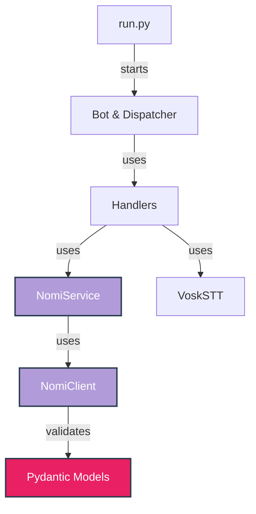

<div align="center">

[](https://github.com/astral-sh/ruff)
[](https://docs.pytest.org/)

</div>

---

## 🧪 Quality Gates

We prioritize code stability. Every Pull Request runs a CI pipeline that checks:

1. **Linting:** No style violations (Ruff).
2. **Typing:** Strict static type checking (Mypy).
3. **Testing:** All unit tests must pass (Pytest).

### ⚡ Quick Check Commands

Run these locally before pushing:

```bash
# 1. Lint & Format
ruff check . --fix
ruff format .

# 2. Type Check
export PYTHONPATH=src
mypy --config-file pyproject.toml src/core src/nomi src/stt

# 3. Run Unit Tests
pytest
```

## 🏗️ Architecture Guide



- **Domain Logic:** Keep logic in `src/nomi/service.py`, not in handlers.
- **Type Safety:** Never use `Dict` or `Any` for API responses. Use schemas in `src/nomi/schemas.py`.
- **Infrastructure:** Use `Dockerfile` for environment consistency.

## 📝 Commit Messages

We follow **Conventional Commits**:

- `feat:` New features
- `fix:` Bug fixes
- `refactor:` Code improvements without logic changes
- `test:` Adding or fixing tests
- `chore:` Config, Docker, CI updates

**Example:**

> `feat(voice): add support for ogg to wav conversion`

-----

<div align="center">
Thank you for making NomiAssistantTG better!
</div>

