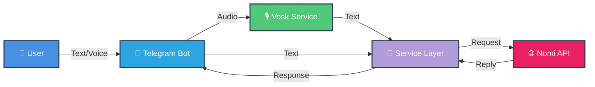

<div align="center">

<p align="center">
  
</p>

[](https://github.com/AmaLS367/Nomi_ai_tg/actions)
[](https://github.com/AmaLS367/Nomi_ai_tg/actions)
[](https://www.python.org/downloads/)
[](LICENSE)
[](https://github.com/astral-sh/ruff)

<p align="center">
  
  
  
</p>

**[🇷🇺 Русская версия](README.ru.md)**

---

</div>

<br/>

**NomiAssistantTG** connects your Telegram bot directly to [Nomi.ai](https://nomi.ai). Send text or voice messages to your Nomi, and receive replies instantly. Built with a focus on code quality, scalability, and ease of deployment.

## ✨ Features

<div align="center">



</div>

| Feature | Description | Status |
|---------|-------------|--------|
| 💬 **Direct Chat** | Real-time messaging with your Nomi | ✅ |
| 🎙️ **Voice Messages** | Offline STT conversion using Vosk & FFmpeg | ✅ |
| 🐳 **Dockerized** | One-command deploy on any OS | ✅ |
| 🛡️ **Type Safety** | 100% Pydantic validation for API responses | ✅ |
| 🧪 **Tested** | High coverage with Pytest & Respx | ✅ |
| 🔄 **Retry Logic** | Smart backoff for 429/500 errors | ✅ |
| 🎯 **Clean Architecture** | Separation of concerns (handlers, services, clients) | ✅ |

## 🚀 Quick Start (Docker)

> [!TIP]
> This is the recommended way to run the bot.

```bash
# 1. Clone the repository
git clone https://github.com/AmaLS367/Nomi_ai_tg.git
cd Nomi_ai_tg

# 2. Configure environment
cp .env.example .env
# Edit .env and set your TELEGRAM_BOT_TOKEN and NOMI_API_KEY

# 3. Start the services
docker-compose up -d --build
```

### 📦 What's Included

The Docker setup includes:
- **Python 3.11 slim** base image
- **FFmpeg** pre-installed for audio processing
- **Vosk model** auto-downloaded (small English model)
- **Non-root user** for security
- **Volume mounts** for persistent data and logs

## 💻 Local Development

<details>
<summary><b>🛠️ Manual Setup Guide</b></summary>

If you want to run it without Docker (e.g., for debugging):

### Prerequisites

- Python 3.11+
- FFmpeg (must be in PATH or set via `FFMPEG_BIN`)
- Git

### Installation

```bash
# 1. Clone repository
git clone https://github.com/AmaLS367/Nomi_ai_tg.git
cd Nomi_ai_tg

# 2. Create virtual environment
python -m venv .venv

# Windows
.\.venv\Scripts\Activate.ps1

# Linux/Mac
source .venv/bin/activate

# 3. Install dependencies
pip install -e .[dev]

# 4. Configure environment
cp .env.example .env
# Edit .env with your tokens

# 5. Download Vosk model (optional, for voice support)
# Download from https://alphacephei.com/vosk/models
# Extract to ./models/vosk-model-small-en-us-0.15
# Set VOSK_MODEL_PATH=./models/vosk-model-small-en-us-0.15 in .env
```

### Running

```bash
python run.py
```

</details>

## ⚙️ Configuration

### Required Variables

| Variable | Description | Example |
|----------|-------------|---------|
| `TELEGRAM_BOT_TOKEN` | Token from [@BotFather](https://t.me/BotFather) | `123456:ABC-DEF...` |
| `NOMI_API_KEY` | API key from [Nomi.ai Integration Settings](https://nomi.ai/profile/integrations) | `sk_live_xxx...` |

### Optional Variables

| Variable | Description | Default |
|----------|-------------|---------|
| `NOMI_DEFAULT_NOMI_UUID` | Specific Nomi ID (auto-selects first if not set) | `None` |
| `LOG_LEVEL` | Logging verbosity | `INFO` |
| `REQUEST_TIMEOUT_SEC` | HTTP timeout for Nomi API | `30` |
| `RATE_LIMIT_RPS` | Requests per second limit | `0.4` |
| `VOSK_MODEL_PATH` | Path to Vosk model folder | `/app/models/vosk-model` |
| `FFMPEG_BIN` | Explicit FFmpeg binary path | auto-detected |
| `MAX_AUDIO_BYTES` | Max voice message size (bytes) | `10485760` (10 MB) |

### Getting Your Nomi UUID

You can query your account to find your Nomi IDs:

```bash
# Using curl
curl -H "Authorization: YOUR_NOMI_API_KEY" https://api.nomi.ai/v1/nomis

# Using PowerShell
$headers = @{ Authorization = "YOUR_NOMI_API_KEY" }
Invoke-RestMethod -Uri "https://api.nomi.ai/v1/nomis" -Headers $headers
```

Copy the `id` field of your desired Nomi and set it in `.env` as `NOMI_DEFAULT_NOMI_UUID`.

## 🎯 Bot Commands

| Command | Description |
|---------|-------------|
| `/start` | Initialize bot and show welcome message |
| `/status` | Display currently active Nomi (name and UUID) |
| `/help` | Show available commands and usage tips |

### Usage Examples

- **Text messages**: Simply send any text to chat with your Nomi
- **Voice messages**: Record and send voice notes (automatically transcribed)
- **Images/Files**: Send URLs in messages or captions (Nomi API doesn't support direct uploads)

## 🏗️ Project Structure

```
nomi_tg_companion/
├── .github/
│   └── workflows/          # CI/CD pipelines
│       ├── quality.yml     # Linting, typing, testing
│       └── docker.yml      # Docker build validation
├── src/
│   ├── app.py             # Main application entry
│   ├── bot/
│   │   ├── app_bot.py     # Bot instance creation
│   │   └── handlers/      # Message and command handlers
│   │       ├── commands.py
│   │       └── messages.py
│   ├── core/
│   │   ├── config.py      # Pydantic settings
│   │   ├── errors.py      # Custom exceptions
│   │   └── logging.py     # Logging setup
│   ├── nomi/
│   │   ├── client.py      # HTTP client with retry logic
│   │   ├── schemas.py     # Pydantic models for API
│   │   └── service.py     # Business logic layer
│   └── stt/
│       └── vosk_stt.py    # Speech-to-text service
├── tests/                 # Pytest suite (80% coverage)
│   ├── conftest.py
│   ├── test_config.py
│   ├── test_nomi_client.py
│   ├── test_nomi_service.py
│   └── test_stt.py
├── docker-compose.yml     # Docker orchestration
├── Dockerfile             # Production image
├── pyproject.toml         # Dependencies & tool configs
└── run.py                 # Simple entry point
```

## 🧪 Development & Testing

We use strict quality gates. Before committing, ensure checks pass:

```bash
# Run Linter (Ruff)
ruff check .
ruff format .

# Run Type Checker (Mypy)
export PYTHONPATH=src
mypy --config-file pyproject.toml src/core src/nomi src/stt

# Run Tests (Pytest)
pytest

# With coverage report
pytest --cov=src --cov-report=term-missing
```

See [CONTRIBUTING.md](CONTRIBUTING.md) for detailed guidelines.

## 🐛 Troubleshooting

<details>
<summary><b>FFmpeg not found</b></summary>

**Symptom:** Voice messages fail with "FFmpeg not found"

**Solution:**
- **Docker**: FFmpeg is pre-installed, no action needed
- **Local**: 
  - Windows: Download from [ffmpeg.org](https://ffmpeg.org/download.html), add to PATH, or set `FFMPEG_BIN` in `.env`
  - Linux: `sudo apt install ffmpeg`
  - Mac: `brew install ffmpeg`

</details>

<details>
<summary><b>Vosk model not found</b></summary>

**Symptom:** Voice transcription fails with "VOSK_MODEL_PATH invalid"

**Solution:**
1. Download a model from [Vosk Models](https://alphacephei.com/vosk/models)
2. Extract to `./models/vosk-model-small-en-us-0.15`
3. Set `VOSK_MODEL_PATH=./models/vosk-model-small-en-us-0.15` in `.env`

</details>

<details>
<summary><b>Bot not responding</b></summary>

**Symptom:** Messages sent to bot receive no reply

**Checklist:**
- ✅ Verify `TELEGRAM_BOT_TOKEN` is correct
- ✅ Check bot is not paused in [@BotFather](https://t.me/BotFather)
- ✅ Ensure `NOMI_API_KEY` is valid (test with curl)
- ✅ Check logs: `docker-compose logs -f` or `./data/logs/app.log`

</details>

<details>
<summary><b>429 Rate Limit errors</b></summary>

**Symptom:** "Rate limit exceeded" messages

**Solution:**
- The bot has built-in retry logic with exponential backoff
- Adjust `RATE_LIMIT_RPS` in `.env` (default: 0.4 = ~1 request per 2.5 seconds)
- Wait a few seconds between messages

</details>

## 📚 Tech Stack

| Category | Technology | Purpose |
|----------|-----------|---------|
| **Framework** | [Aiogram 3](https://docs.aiogram.dev/) | Async Telegram bot framework |
| **HTTP Client** | [HTTPX](https://www.python-httpx.org/) | Async HTTP with retry logic |
| **Validation** | [Pydantic V2](https://docs.pydantic.dev/) | Type-safe data models |
| **STT** | [Vosk](https://alphacephei.com/vosk/) | Offline speech recognition |
| **Audio** | [FFmpeg](https://ffmpeg.org/) | Audio format conversion |
| **Testing** | [Pytest](https://docs.pytest.org/) + [Respx](https://lundberg.github.io/respx/) | Unit tests with HTTP mocking |
| **Linting** | [Ruff](https://docs.astral.sh/ruff/) | Fast Python linter & formatter |
| **Type Checking** | [Mypy](https://mypy.readthedocs.io/) | Static type analysis |

## 🤝 Contributing

Contributions are welcome! Please read [CONTRIBUTING.md](CONTRIBUTING.md) for:
- Code quality standards
- Testing requirements
- Architecture guidelines
- Commit message conventions

## 📄 License

This project is licensed under the MIT License - see the [LICENSE](LICENSE) file for details.

## 🙏 Acknowledgments

- [Nomi.ai](https://nomi.ai) for the amazing AI companion platform
- [Vosk](https://alphacephei.com/vosk/) team for offline STT
- [Aiogram](https://docs.aiogram.dev/) community

-----

<div align="center">

### 🌟 Star History

[](https://star-history.com/#AmaLS367/Nomi_ai_tg&Date)


</div>
