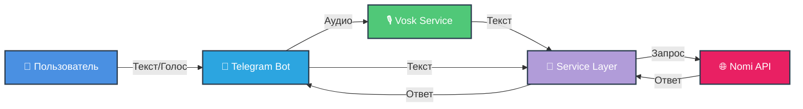

<div align="center">

<p align="center">
  
</p>

[](https://github.com/AmaLS367/Nomi_ai_tg/actions)
[](https://github.com/AmaLS367/Nomi_ai_tg/actions)
[](https://www.python.org/downloads/)
[](LICENSE)
[](https://github.com/astral-sh/ruff)

<p align="center">
  
  
  
</p>

**[🇬🇧 English version](README.md)**

---

</div>

<br/>

**NomiAssistantTG** подключает ваш Telegram бот напрямую к [Nomi.ai](https://nomi.ai). Отправляйте текстовые или голосовые сообщения вашему Nomi и получайте ответы мгновенно. Проект построен с фокусом на качество кода, масштабируемость и простоту развертывания.

## ✨ Возможности

<div align="center">



</div>

| Возможность | Описание | Статус |
|-------------|----------|--------|
| 💬 **Прямой чат** | Обмен сообщениями с вашим Nomi в реальном времени | ✅ |
| 🎙️ **Голосовые сообщения** | Оффлайн распознавание речи с помощью Vosk & FFmpeg | ✅ |
| 🐳 **Dockerизация** | Разворачивание одной командой на любой ОС | ✅ |
| 🛡️ **Типобезопасность** | 100% валидация Pydantic для ответов API | ✅ |
| 🧪 **Тестирование** | Высокое покрытие тестами с Pytest & Respx | ✅ |
| 🔄 **Логика повторов** | Умный backoff для ошибок 429/500 | ✅ |
| 🎯 **Чистая архитектура** | Разделение ответственности (handlers, services, clients) | ✅ |

## 🚀 Быстрый старт (Docker)

> [!TIP]
> Это рекомендуемый способ запуска бота.

```bash
# 1. Клонируйте репозиторий
git clone https://github.com/AmaLS367/Nomi_ai_tg.git
cd Nomi_ai_tg

# 2. Настройте окружение
cp .env.example .env
# Отредактируйте .env и укажите TELEGRAM_BOT_TOKEN и NOMI_API_KEY

# 3. Запустите сервисы
docker-compose up -d --build
```

### 📦 Что включено

Docker-сборка включает:
- **Python 3.11 slim** базовый образ
- **FFmpeg** предустановлен для обработки аудио
- **Vosk модель** автоматически загружается (маленькая английская модель)
- **Непривилегированный пользователь** для безопасности
- **Volume монтирование** для данных и логов

## 💻 Локальная разработка

<details>
<summary><b>🛠️ Руководство по ручной установке</b></summary>

Если вы хотите запустить без Docker (например, для отладки):

### Требования

- Python 3.11+
- FFmpeg (должен быть в PATH или указан через `FFMPEG_BIN`)
- Git

### Установка

```bash
# 1. Клонируйте репозиторий
git clone https://github.com/AmaLS367/Nomi_ai_tg.git
cd Nomi_ai_tg

# 2. Создайте виртуальное окружение
python -m venv .venv

# Windows
.\.venv\Scripts\Activate.ps1

# Linux/Mac
source .venv/bin/activate

# 3. Установите зависимости
pip install -e .[dev]

# 4. Настройте окружение
cp .env.example .env
# Отредактируйте .env с вашими токенами

# 5. Скачайте модель Vosk (опционально, для голосовых сообщений)
# Загрузите с https://alphacephei.com/vosk/models
# Распакуйте в ./models/vosk-model-small-en-us-0.15
# Укажите VOSK_MODEL_PATH=./models/vosk-model-small-en-us-0.15 в .env
```

### Запуск

```bash
python run.py
```

</details>

## ⚙️ Конфигурация

### Обязательные переменные

| Переменная | Описание | Пример |
|------------|----------|--------|
| `TELEGRAM_BOT_TOKEN` | Токен от [@BotFather](https://t.me/BotFather) | `123456:ABC-DEF...` |
| `NOMI_API_KEY` | API ключ из [настроек интеграции Nomi.ai](https://nomi.ai/profile/integrations) | `sk_live_xxx...` |

### Необязательные переменные

| Переменная | Описание | По умолчанию |
|------------|----------|--------------|
| `NOMI_DEFAULT_NOMI_UUID` | ID конкретного Nomi (авто-выбор первого, если не указан) | `None` |
| `LOG_LEVEL` | Уровень логирования | `INFO` |
| `REQUEST_TIMEOUT_SEC` | HTTP таймаут для Nomi API | `30` |
| `RATE_LIMIT_RPS` | Лимит запросов в секунду | `0.4` |
| `VOSK_MODEL_PATH` | Путь к папке с моделью Vosk | `/app/models/vosk-model` |
| `FFMPEG_BIN` | Явный путь к бинарнику FFmpeg | авто-определение |
| `MAX_AUDIO_BYTES` | Макс. размер голосового сообщения (байты) | `10485760` (10 МБ) |

### Получение UUID вашего Nomi

Вы можете запросить свой аккаунт для получения ID Nomi:

```bash
# Используя curl
curl -H "Authorization: YOUR_NOMI_API_KEY" https://api.nomi.ai/v1/nomis

# Используя PowerShell
$headers = @{ Authorization = "YOUR_NOMI_API_KEY" }
Invoke-RestMethod -Uri "https://api.nomi.ai/v1/nomis" -Headers $headers
```

Скопируйте поле `id` нужного Nomi и укажите его в `.env` как `NOMI_DEFAULT_NOMI_UUID`.

## 🎯 Команды бота

| Команда | Описание |
|---------|----------|
| `/start` | Инициализация бота и приветственное сообщение |
| `/status` | Показать активного Nomi (имя и UUID) |
| `/help` | Показать доступные команды и подсказки |

### Примеры использования

- **Текстовые сообщения**: Просто отправьте любой текст для общения с вашим Nomi
- **Голосовые сообщения**: Запишите и отправьте голосовое сообщение (автоматически транскрибируется)
- **Изображения/Файлы**: Отправляйте URL в сообщениях или подписях (Nomi API не поддерживает прямую загрузку)

## 🏗️ Структура проекта

```
nomi_tg_companion/
├── .github/
│   └── workflows/          # CI/CD пайплайны
│       ├── quality.yml     # Линтинг, типизация, тесты
│       └── docker.yml      # Валидация Docker сборки
├── src/
│   ├── app.py             # Точка входа приложения
│   ├── bot/
│   │   ├── app_bot.py     # Создание экземпляра бота
│   │   └── handlers/      # Обработчики сообщений и команд
│   │       ├── commands.py
│   │       └── messages.py
│   ├── core/
│   │   ├── config.py      # Настройки Pydantic
│   │   ├── errors.py      # Кастомные исключения
│   │   └── logging.py     # Настройка логирования
│   ├── nomi/
│   │   ├── client.py      # HTTP клиент с логикой повторов
│   │   ├── schemas.py     # Pydantic модели для API
│   │   └── service.py     # Слой бизнес-логики
│   └── stt/
│       └── vosk_stt.py    # Сервис распознавания речи
├── tests/                 # Pytest тесты (80% покрытия)
│   ├── conftest.py
│   ├── test_config.py
│   ├── test_nomi_client.py
│   ├── test_nomi_service.py
│   └── test_stt.py
├── docker-compose.yml     # Docker оркестрация
├── Dockerfile             # Production образ
├── pyproject.toml         # Зависимости и конфиг инструментов
└── run.py                 # Простая точка входа
```

## 🧪 Разработка и тестирование

Мы используем строгие проверки качества. Перед коммитом убедитесь, что все проверки проходят:

```bash
# Запустить линтер (Ruff)
ruff check .
ruff format .

# Запустить проверку типов (Mypy)
export PYTHONPATH=src
mypy --config-file pyproject.toml src/core src/nomi src/stt

# Запустить тесты (Pytest)
pytest

# С отчетом о покрытии
pytest --cov=src --cov-report=term-missing
```

См. [CONTRIBUTING.md](CONTRIBUTING.md) для подробных рекомендаций.

## 🐛 Решение проблем

<details>
<summary><b>FFmpeg не найден</b></summary>

**Симптом:** Голосовые сообщения падают с "FFmpeg not found"

**Решение:**
- **Docker**: FFmpeg предустановлен, ничего делать не нужно
- **Локально**: 
  - Windows: Скачайте с [ffmpeg.org](https://ffmpeg.org/download.html), добавьте в PATH, или укажите `FFMPEG_BIN` в `.env`
  - Linux: `sudo apt install ffmpeg`
  - Mac: `brew install ffmpeg`

</details>

<details>
<summary><b>Модель Vosk не найдена</b></summary>

**Симптом:** Транскрипция голоса падает с "VOSK_MODEL_PATH invalid"

**Решение:**
1. Скачайте модель с [Vosk Models](https://alphacephei.com/vosk/models)
2. Распакуйте в `./models/vosk-model-small-en-us-0.15`
3. Укажите `VOSK_MODEL_PATH=./models/vosk-model-small-en-us-0.15` в `.env`

</details>

<details>
<summary><b>Бот не отвечает</b></summary>

**Симптом:** Сообщения боту не получают ответа

**Чек-лист:**
- ✅ Проверьте, что `TELEGRAM_BOT_TOKEN` корректный
- ✅ Убедитесь, что бот не на паузе в [@BotFather](https://t.me/BotFather)
- ✅ Проверьте валидность `NOMI_API_KEY` (протестируйте с curl)
- ✅ Проверьте логи: `docker-compose logs -f` или `./data/logs/app.log`

</details>

<details>
<summary><b>Ошибки 429 Rate Limit</b></summary>

**Симптом:** Сообщения "Rate limit exceeded"

**Решение:**
- В боте встроена логика повторов с экспоненциальной задержкой
- Настройте `RATE_LIMIT_RPS` в `.env` (по умолчанию: 0.4 = ~1 запрос в 2.5 секунды)
- Подождите несколько секунд между сообщениями

</details>

## 📚 Технологический стек

| Категория | Технология | Назначение |
|-----------|------------|------------|
| **Фреймворк** | [Aiogram 3](https://docs.aiogram.dev/) | Асинхронный фреймворк для Telegram ботов |
| **HTTP клиент** | [HTTPX](https://www.python-httpx.org/) | Async HTTP с логикой повторов |
| **Валидация** | [Pydantic V2](https://docs.pydantic.dev/) | Типобезопасные модели данных |
| **STT** | [Vosk](https://alphacephei.com/vosk/) | Оффлайн распознавание речи |
| **Аудио** | [FFmpeg](https://ffmpeg.org/) | Конвертация аудио форматов |
| **Тестирование** | [Pytest](https://docs.pytest.org/) + [Respx](https://lundberg.github.io/respx/) | Unit-тесты с HTTP мокингом |
| **Линтинг** | [Ruff](https://docs.astral.sh/ruff/) | Быстрый Python линтер и форматтер |
| **Типизация** | [Mypy](https://mypy.readthedocs.io/) | Статический анализ типов |

## 🤝 Вклад в проект

Вклады приветствуются! Пожалуйста, прочитайте [CONTRIBUTING.md](CONTRIBUTING.md) для:
- Стандартов качества кода
- Требований к тестированию
- Архитектурных рекомендаций
- Конвенций сообщений коммитов

## 📄 Лицензия

Этот проект лицензирован под MIT License - см. файл [LICENSE](LICENSE) для деталей.

## 🙏 Благодарности

- [Nomi.ai](https://nomi.ai) за потрясающую платформу ИИ-компаньонов
- Команде [Vosk](https://alphacephei.com/vosk/) за оффлайн STT
- Сообществу [Aiogram](https://docs.aiogram.dev/)

-----

<div align="center">

### 🌟 История звезд

[](https://star-history.com/#AmaLS367/Nomi_ai_tg&Date)


</div>

